# vota_dolores_hidalgo

A new Flutter project.

# Ronda 1

## En esta ronda se definieron y ejecutaron las primeras pruebas del sistema, con el propósito de identificar el comportamiento esperado de las funcionalidades y comprobar que los casos de prueba se ejecutaran correctamente.

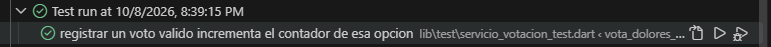

# Ronda 2

## Durante esta ronda se desarrolló el código necesario para cumplir con los requisitos establecidos en las pruebas. Se verificó el funcionamiento de las funcionalidades implementadas y se identificaron posibles errores.

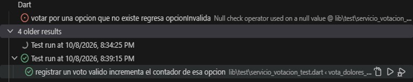 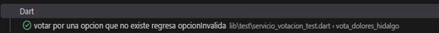

# Ronda 3

## En esta ronda se ejecutaron nuevamente las pruebas para comprobar el funcionamiento del código. Se revisaron los resultados obtenidos y se realizaron los ajustes necesarios para corregir los errores detectados.

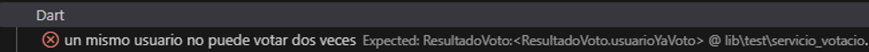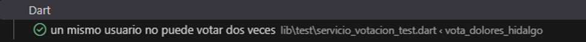

# Ronda 4

## En esta ronda se revisó el comportamiento del código mediante la ejecución de las pruebas correspondientes. Se analizaron los errores presentados para identificar sus causas y realizar las correcciones necesarias, con el objetivo de lograr que las pruebas se ejecutaran satisfactoriamente.

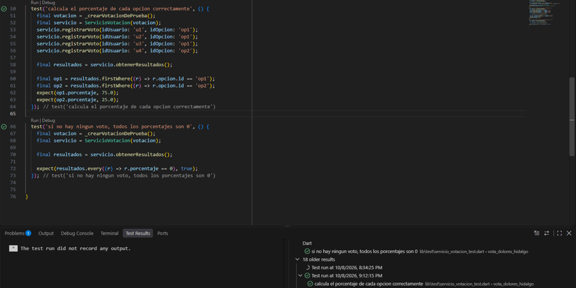

# Ronda 5

## En esta ronda se implementó y probó la funcionalidad encargada de identificar la opción con la mayor cantidad de votos. Se verificó que el sistema devolviera correctamente la opción ganadora de acuerdo con los resultados registrados. 

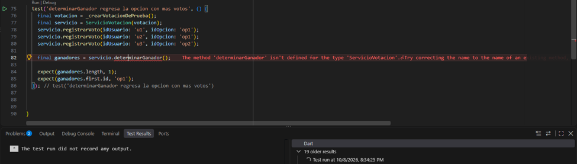 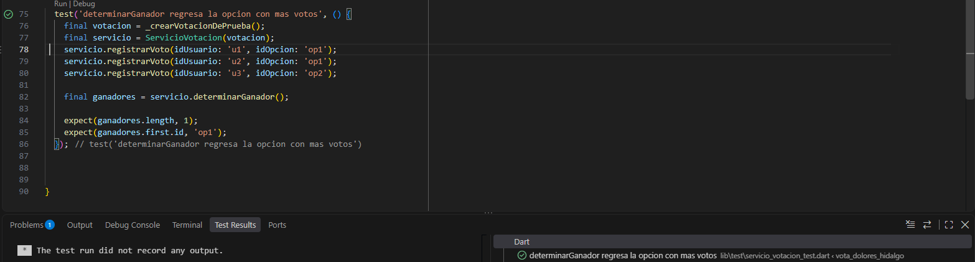

# Ronda 6

## En esta ronda se comprobó que el sistema pudiera reconocer cuando dos o más opciones obtuvieran la misma cantidad máxima de votos. Se verificó que todas las opciones empatadas fueran identificadas como ganadoras, evitando seleccionar una opción al azar.

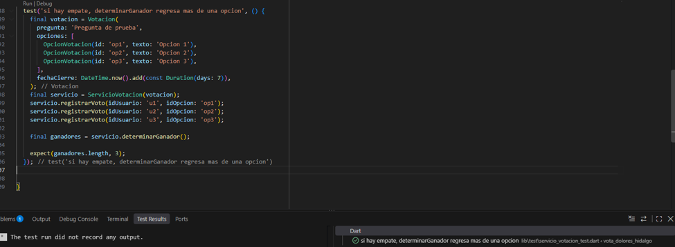

# Ronda 7
## En esta ronda se agregó la validación de la fecha de cierre de la votación. Se realizaron pruebas para comprobar que el sistema rechazara los votos cuando la votación ya hubiera finalizado y permitiera registrar votos mientras permaneciera abierta.

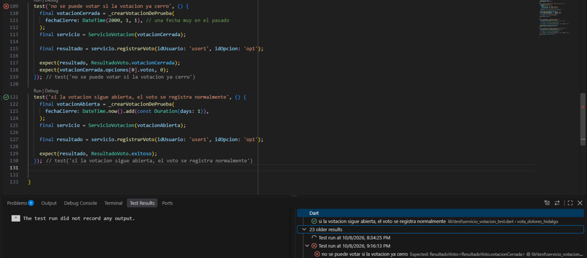 

# Ronda 8
## En esta ronda se mejoró la organización y legibilidad del método encargado de registrar los votos mediante condiciones de validación más claras. Se mantuvo el comportamiento de las reglas de negocio y se verificó que las pruebas anteriores continuaran funcionando correctamente.

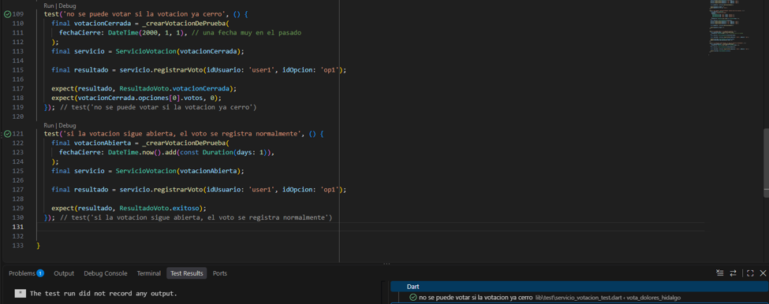

# Prueba de integracion Simulacion completa de la votacion
## En esta prueba se simuló el funcionamiento completo del sistema mediante el registro de votos de varios usuarios. Se verificó que los votos válidos fueran contabilizados, que se rechazara un intento de voto duplicado y que el sistema identificara correctamente la opción ganadora al consultar los resultados.

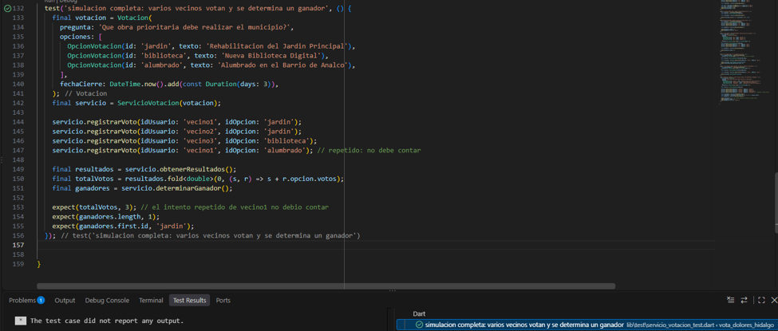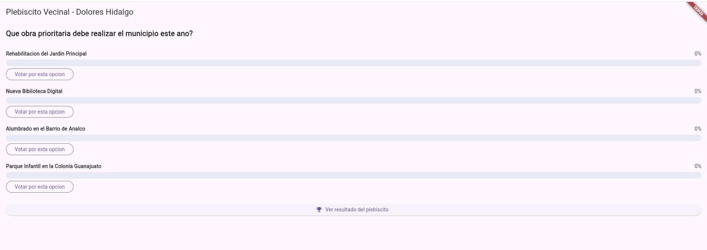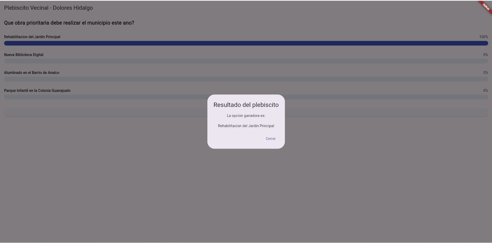 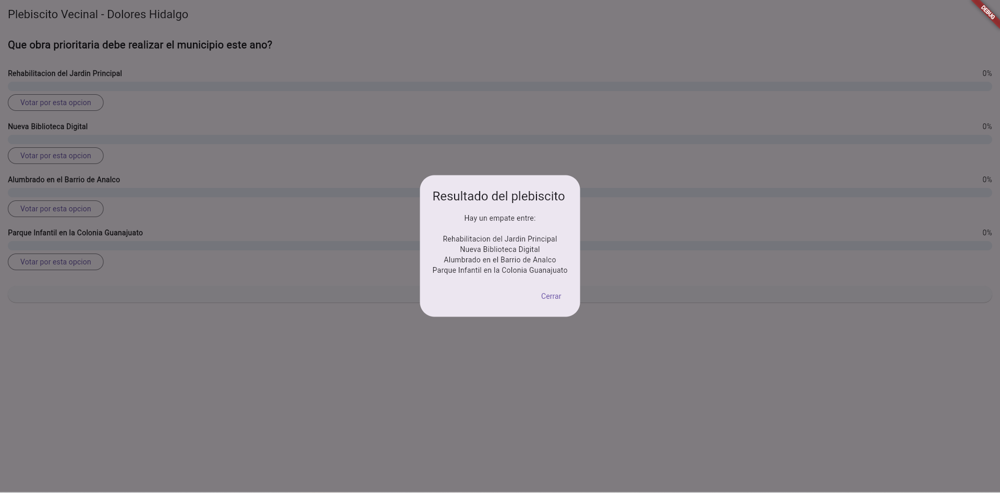
